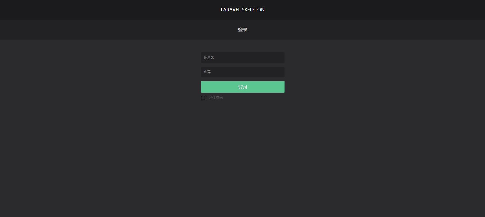
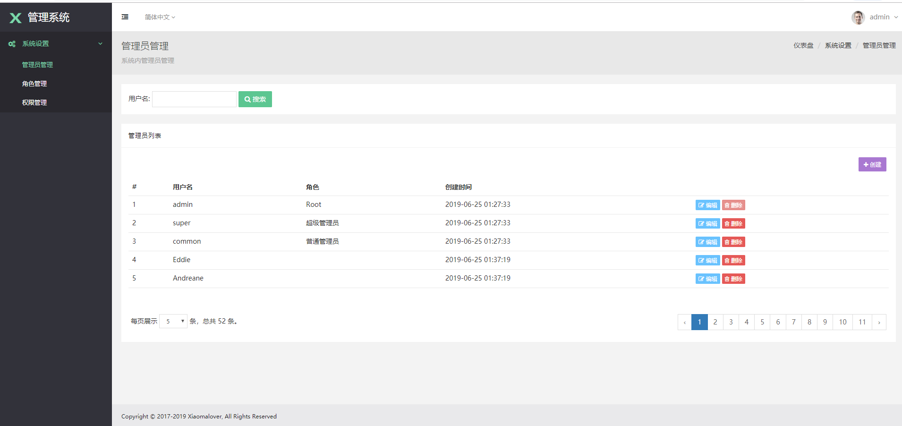
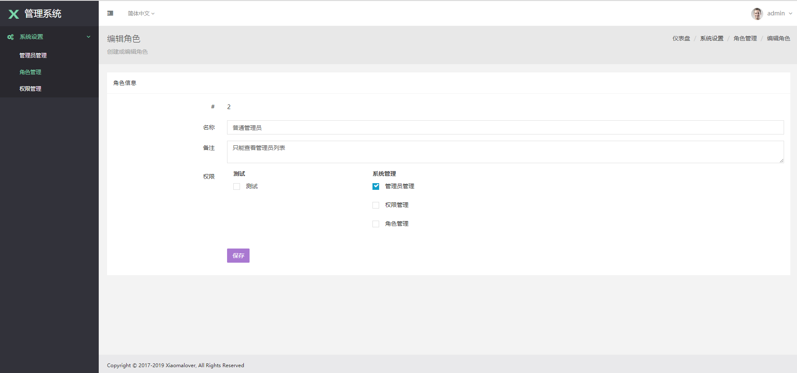
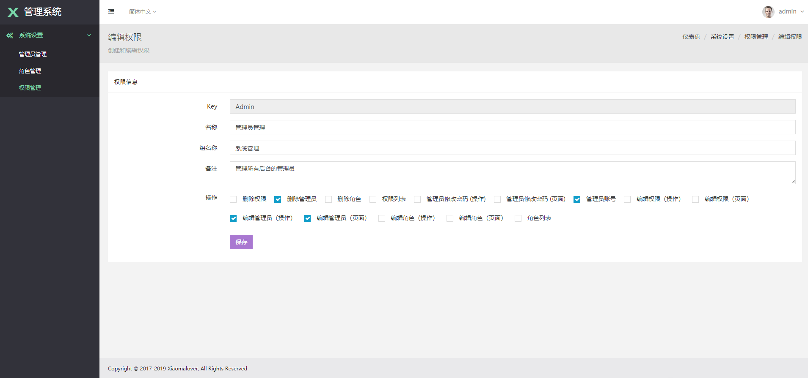

Laravel Skeleton
===================================
This is a skeleton application based on laravel, you can use it to build you own web site system.


Installation
--------
1, Clone the source code, and cd in root path
```
$ git clone https://github.com/xiaomalover/laravel-skeleton.git && cd laravel-skeleton
```
2, Composer update
```
$ composer update
```
3, Modify the database and email config in .env file

4, Create database schema
```
$ php artisan migrate
```
5, Create database record (The main purpose is to create admin user)
```
$ php artisan db:seed
```
6, Install passport (Mainly for the api module to auth user).
```
$ php artisan passport:install
```
7, If you want login to backend, please find user in database, and change first user's user name to admin, the password for all user is 123456

8, Enjoy!!!

Preview
---------
Login



Admin management



Role management



Permission management




Contact
--------
Wechat qrcode

